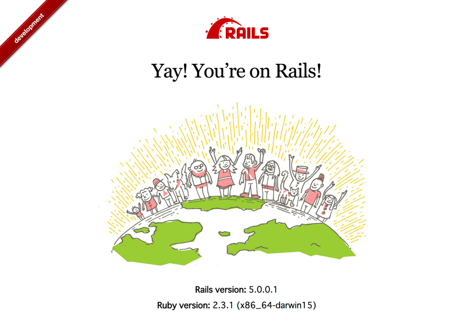

# Rack::EnvRibbon
Add env ribbon on your rack application views.



## Installation

```sh
$ gem install rack-env_ribbon
```

### Rack application

Add `use Rack::EnvRibbon` on your `config.ru` file.

```rb
require 'rack/env_ribbon'

app # => your rack application object

use Rack::EnvRibbon
run app
```

### Sinatra

Add `use Rack::EnvRibbon` in the same way as rack application.

```rb
require 'sinatra'

require 'rack/env_ribbon'

use Rack::EnvRibbon

get '/' do
  <<-HTML
<!DOCTYPE html>
<html lang="ja">
<head>
    <meta charset="utf-8">
    <title>sinatra app</title>
</head>
<body>
    <p>app body</p>
</body>
</html>
  HTML
end
```

### Rails

Add this line to your application's Gemfile:

```ruby
gem 'rack-env_ribbon', require: 'rack/env_ribbon/railtie'
```

And then execute:
```bash
$ bundle
```

## License
The gem is available as open source under the terms of the [MIT License](http://opensource.org/licenses/MIT).
